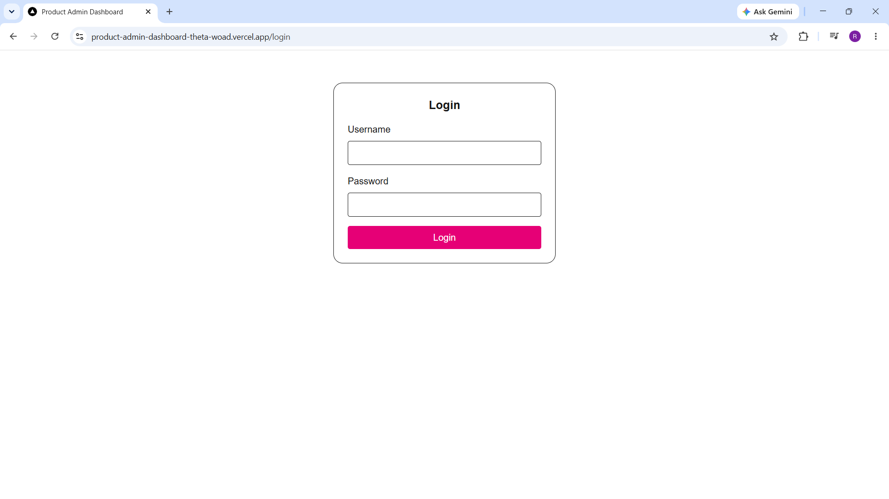
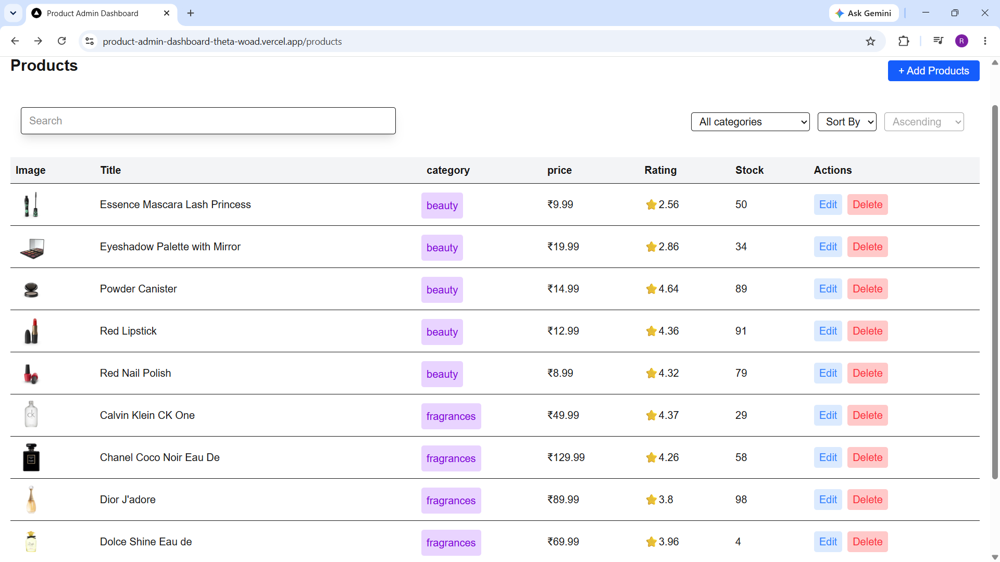
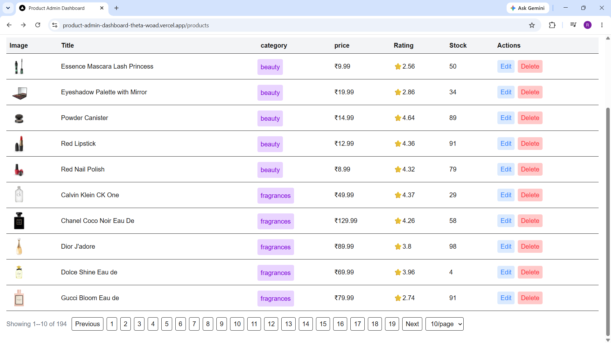
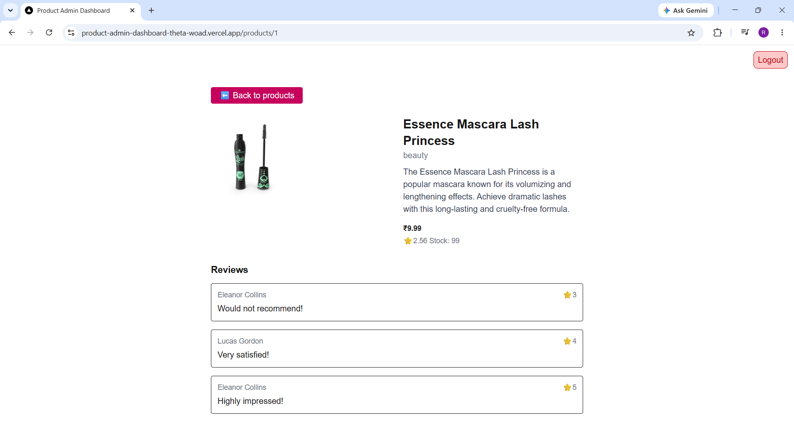
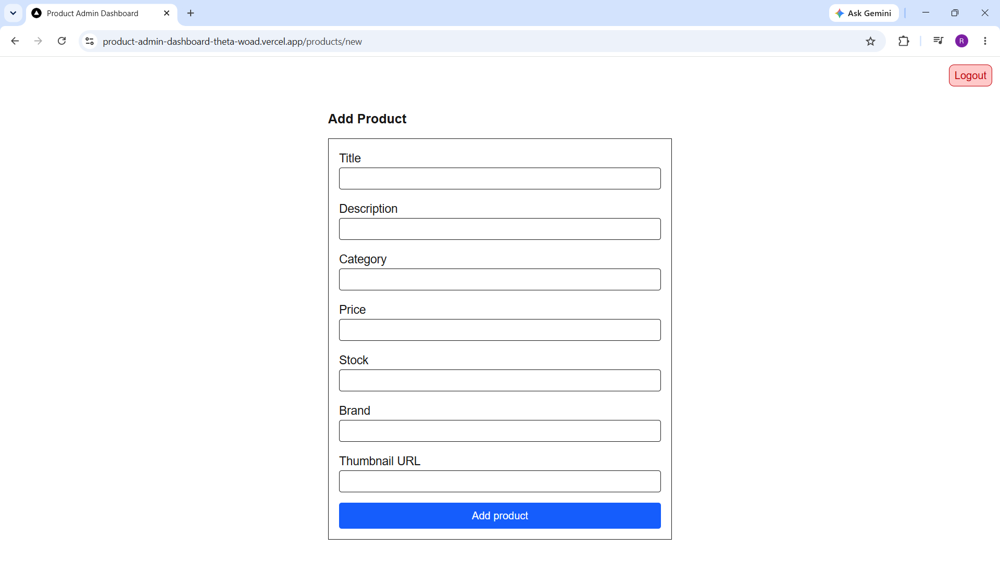
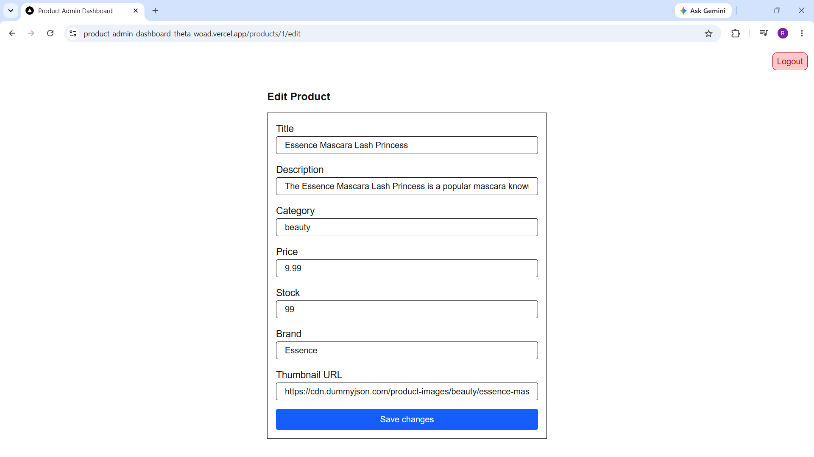
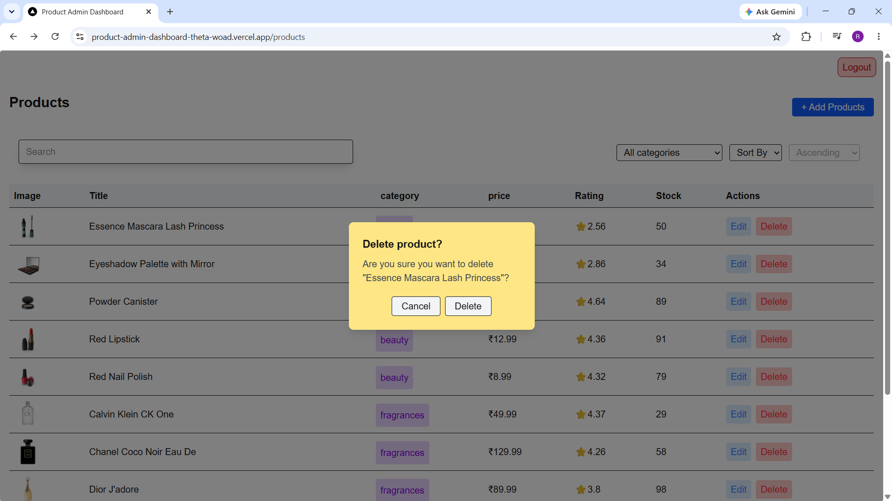

# 🛒 Product Admin Dashboard

A Frontend Admin Dashboard built with Next.js, React, and Tailwind CSS, where a logged-in user can browse, search, filter, sort, view, add, edit, and delete products using the DummyJSON API. All API calls go through a single shared Axios instance.

---
## Features 
- Login with validation, error handling, and protected routes
- Product list with image, title, category, price, rating and stock
- Pagination with page numbaers, Previous/Next, and a page-size selector(10/20/50)
- Filter by category and sort by price, rating, or title
- Product detail page with images, description, and reviews
- Add, edit and delete products with form validation and delete confirmation modal

---
## Tech Stack
**Frontend :** 
- Next.js(App Router)
- React
- Tailwind CSS
- Axios(for API calls)

**API :**
- DummyJSON - products, category, and auth

---
## Tools Used
- VS Code for development
- Git & GitHub for version control
- Vercel for deployment

---
## Setup

1. Clone the repo:
 ```bash
 git clone https://github.com/rutikajadhav-8/product-admin-dashboard.git
 cd product-admin-dashboard

2. Install dependencies:
   npm install

3. Run dev server:
   npm run dev

4. Open http://localhost:3000 and log in with:
   Username : emilys
   Password : emilyspass
```
---
## Live Demo
- Live app: https://product-admin-dashboard-theta-woad.vercel.app
- Git Repo: https://github.com/rutikajadhav-8/product-admin-dashboard

---
## Screenshots:

- **Login Page:**


  
- **Product List Page:**





- **Product Detail Page:**



- **Add Product Page:**



- **Edit Product Page:**



- **Delete Confirmation Modal:**


